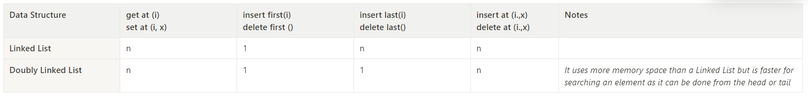

# Data Structures
This module contains the implementations of a few different data structures where the goal of this project is to first understand better the underlying structure of these famous data structures and last but not least is to use this as an exercise to practice TDD.

# Road Map
- [x] Linked List 
- [x] Doubly Linked List
- [x] Stack
- [ ] Hash Table
- [ ] Binary Tree
- [ ] Binary Heap
- [ ] AVL Tree
- [ ] Black and Red Tree
- [ ] Hash Set
- [ ] Tree Set
- [ ] Graph

# Complexity
